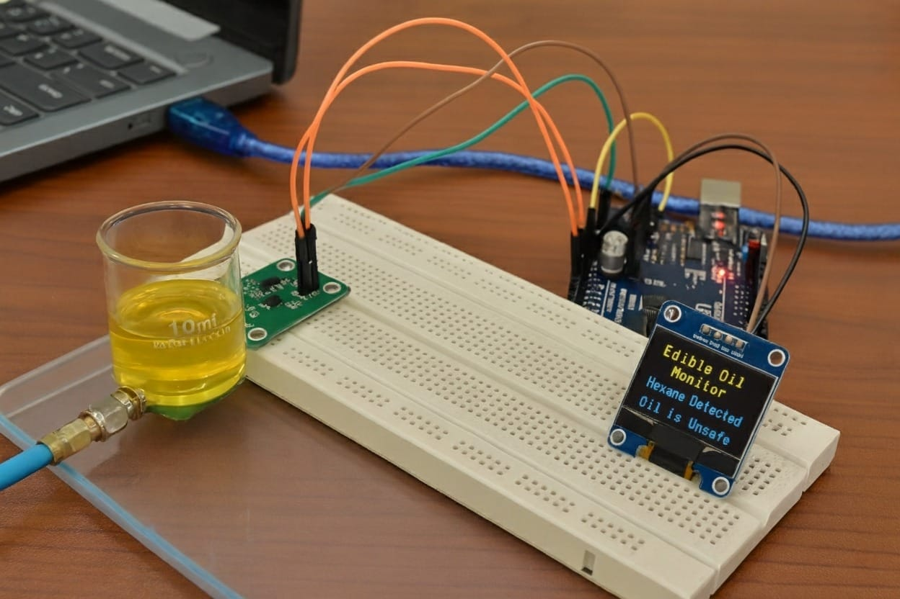
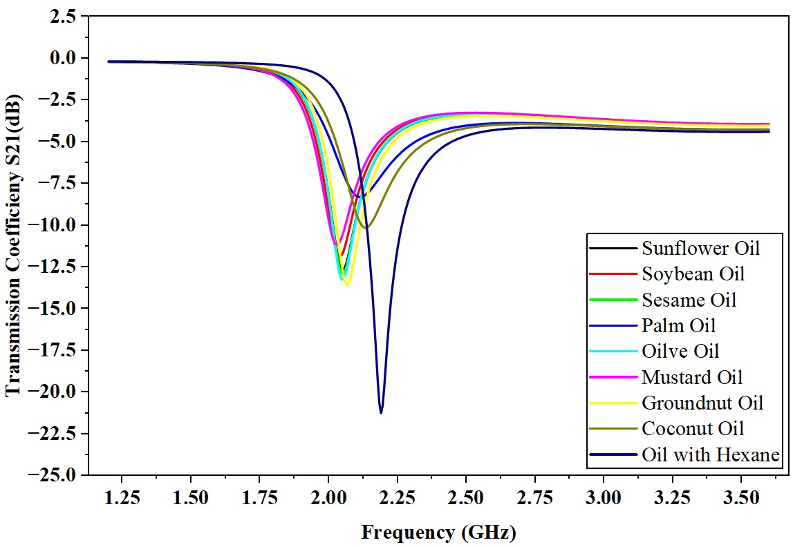
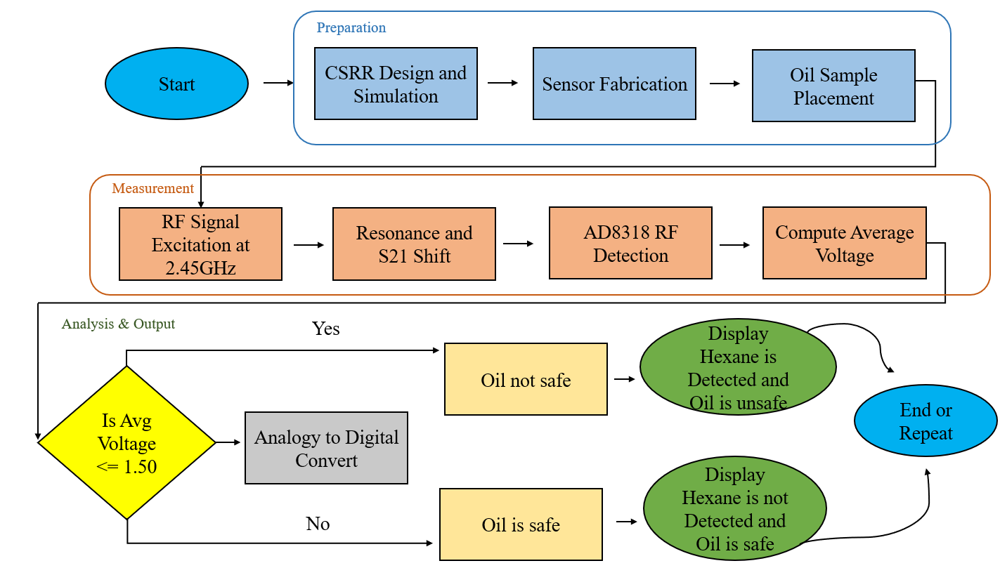
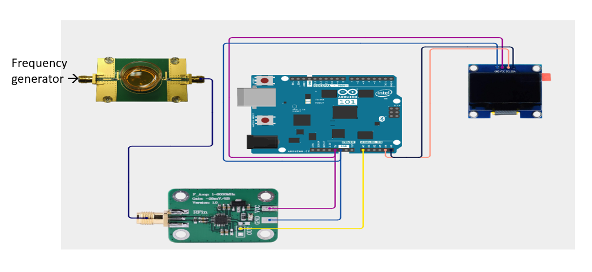

# 🛢️ Toxin Detection in Edible Oil Using Microwave Sensor

> A Non-Invasive Microwave Metamaterial Sensor for Detecting Hexane Contamination in Edible Oils

---

# 📖 Overview

This project presents a **non-invasive microwave sensing system** capable of detecting **Hexane contamination in edible oil** using a **Complementary Split Ring Resonator (CSRR) Microwave Sensor**.

Instead of using expensive laboratory equipment like Gas Chromatography, this system uses the change in dielectric properties of edible oil to detect contamination.

The sensor operates at **2.45 GHz** and measures the resonance shift caused by Hexane.

The measured RF signal is converted into DC voltage using the **AD8318 RF Detector**, processed by an **Arduino Uno**, and displayed on an **OLED Display**.

---

# 🎯 Objectives

- Detect Hexane contamination in edible oil
- Non-destructive testing
- Real-time monitoring
- Portable and low-cost system
- Food safety monitoring

---

# 🚀 Features

✔ Non-invasive detection

✔ Real-time monitoring

✔ Microwave sensing

✔ Portable hardware

✔ OLED Display Output

✔ Arduino based processing

✔ RF Power Detection using AD8318

✔ Fast detection

✔ Low-cost implementation

---

# 🛠 Hardware Used

- CSRR Microwave Sensor
- Arduino UNO
- AD8318 RF Detector
- OLED Display (0.96")
- RF Signal Generator
- SMA Connectors
- FR4 PCB
- Borosilicate Glass Sample Holder
- Connecting Wires

---

# 💻 Software Used

- ANSYS HFSS
- Arduino IDE
- PCB Design Software
- Microsoft Excel
- Origin / MATLAB (for plotting)

---

# ⚙ Working Principle

1. Generate RF signal (2.45 GHz)
2. Feed signal into CSRR Sensor
3. Place edible oil sample over sensor
4. Measure resonance frequency shift
5. AD8318 converts RF power into DC voltage
6. Arduino reads voltage
7. Compare with threshold
8. Display

Safe Oil

or

Hexane Detected

on OLED display.

---

# 📊 System Flow

Frequency Generator

↓

CSRR Microwave Sensor

↓

Oil Sample

↓

AD8318 RF Detector

↓

Arduino UNO

↓

OLED Display

---

# 📈 Experimental Results

The sensor successfully distinguishes pure edible oils from Hexane contaminated oil by observing:

- Resonance Frequency Shift
- Transmission Coefficient (S21)
- Detector Output Voltage

Hexane contaminated oil produces a deeper resonance notch and lower detector voltage compared to pure oils.

---

# 🖼 Prototype

(Add Prototype Image Here)

---

# 📉 Simulation Result

---

# 📋 Flow Chart

---

# 📷 Hardware Setup

---

# 📚 Applications

- Food Quality Monitoring
- Oil Refining Industries
- Food Safety Inspection
- Research Laboratories
- Industrial Quality Control

---

# 🔮 Future Scope

- IoT Based Monitoring
- Cloud Dashboard
- AI Classification
- Mobile Application
- Automatic Quality Report
- Multi-Toxin Detection

---

# 📖 Research Publication

This work has been presented in an IEEE International Conference.

**Title**

Design and Analysis of Non-Invasive RF Microwave Based Sensor for Toxin Detection in Edible Oil

Conference:

4th International Conference on Electronics and Renewable Systems (ICEARS 2026)

---

# 📜 Certificate

IEEE Conference Presentation Certificate Included.

---

# 👨‍💻 Authors

Gokul K

Electronics and Communication Engineering

Research Interests

- Microwave Sensors
- PCB Design
- Embedded Systems
- RF Engineering
- Food Safety Sensors

---

# 📄 Citation

If you use this work in your research, please cite:

Gokul K,

Design and Analysis of Non-Invasive RF Microwave Based Sensor for Toxin Detection in Edible Oil,

Presented at ICEARS 2026.

---

# 🙏 Acknowledgement

Special thanks to

- IEEE
- ICEARS 2026
- Project Supervisor
- Electronics and Communication Engineering Department
- Research Team

---
